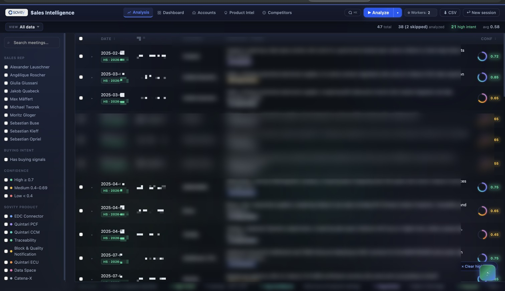
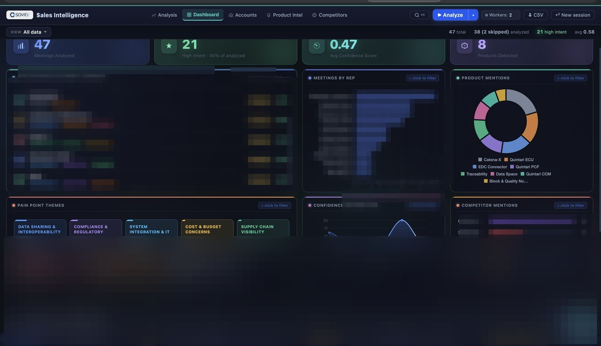
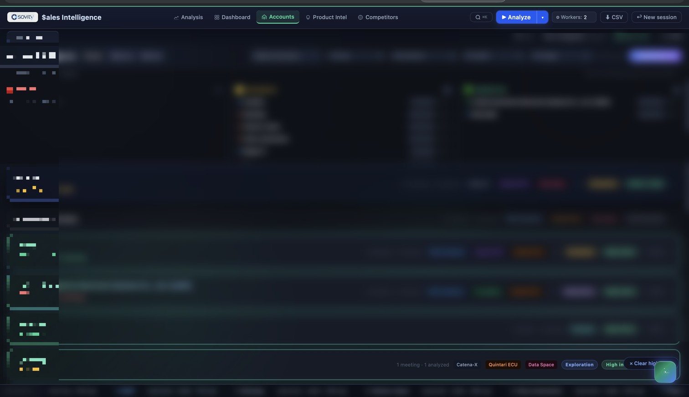
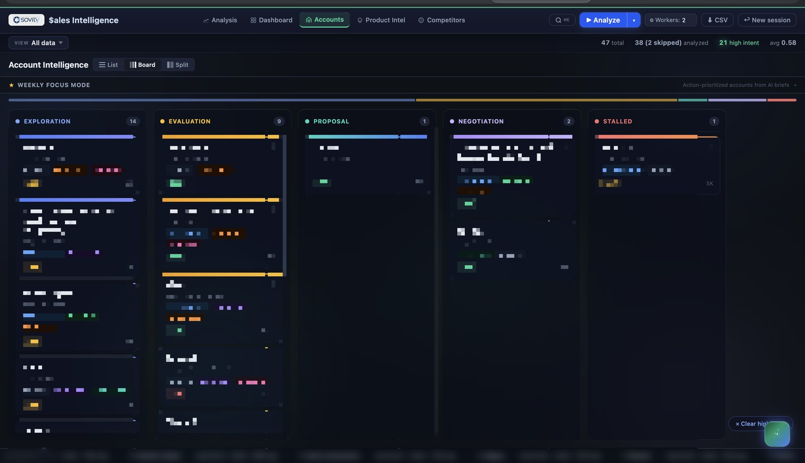
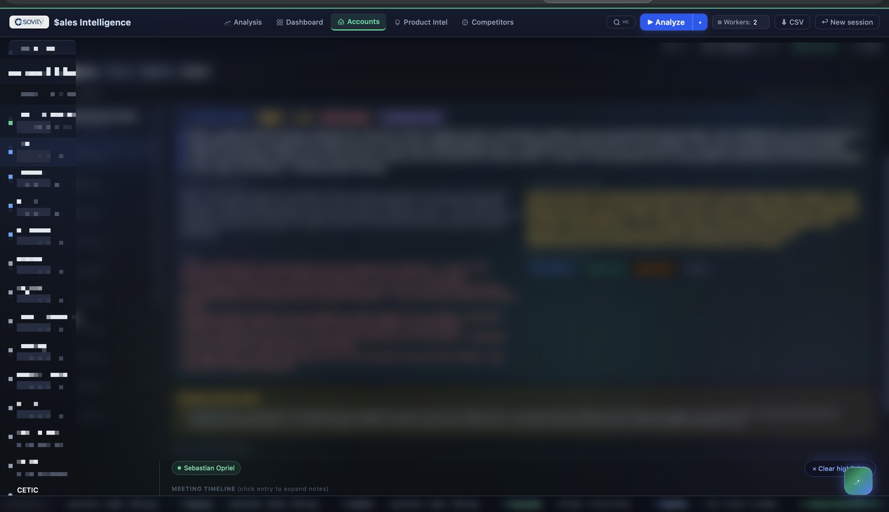
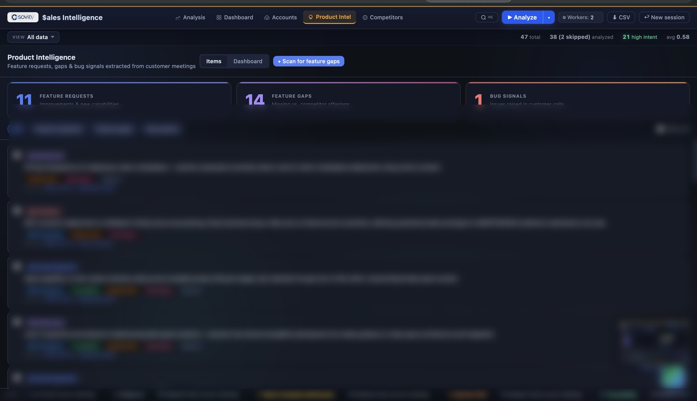
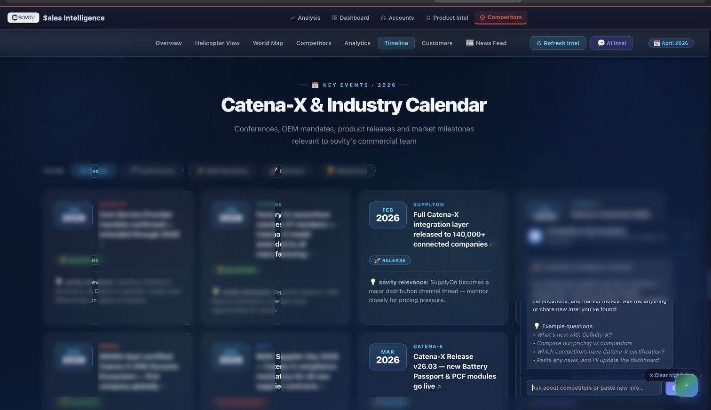

# 🧠 sovity Sales Intelligence (SSI)

> **AI-powered meeting intelligence platform** that turns raw HubSpot meeting notes into structured account intelligence — and powers a 5-phase pipeline from customer voice → sovity-grade product backlog drafts and strategic-hypothesis validation.

[](https://python.org)
[](https://fastapi.tiangolo.com)
[](https://anthropic.com)
[](https://huggingface.co)
[](https://developer.mozilla.org/en-US/docs/Web/JavaScript)
[](https://github.com/megadave19/ssi-portfolio-assets)

📖 **[Full case study on Notion →](https://www.notion.so/Antarang-Gaur-356a2e9f37e281ff8fe9ef90ab8bd7a4)**
🔧 **[Technical deep dive →](https://www.notion.so/35fa2e9f37e281a4add0e58fe4de671e)**

> 🔒 **Source code lives in a private GitHub repository.** This public repo hosts the case-study README and screenshots only. Code access available on request — [LinkedIn](https://www.linkedin.com/in/antarang-gaur/) or [gaur.beenu@gmail.com](mailto:gaur.beenu@gmail.com).

---

## What it does

The sovity sales team runs 10–20 customer meetings per week. Meeting notes lived in HubSpot and Excel — unstructured, unsearchable, and impossible to synthesise across accounts. **And** customer feature requests / pain signals never reached the product backlog — they died in HubSpot.

**SSI solves both halves:**

**Sales-prep side (v0.1 – v0.6)**

1. **Ingest** — drag-and-drop Excel or HubSpot CSV export
2. **Analyse** — Claude Haiku extracts 12 structured fields from every meeting note (pain points, requirements, deal stage, confidence score, competitors, products) using multi-worker parallel processing
3. **Synthesise** — Claude Sonnet generates an executive account brief by reasoning across all meetings for that company

Result: a sales rep goes from raw notes → full account intelligence in under 60 seconds.

**Product-backlog side (v0.7 — the pivot)**

A second pipeline runs alongside the sales surfaces, turning every customer-voice signal into either a **sovity-grade product backlog draft** or **strategic-hypothesis validation evidence**:

| Phase | What it does | Model |
|---|---|---|
| **1** — sovity-Domain Classifier | Routes every signal across the 4-vertical × 4-maturity sovity scope matrix → `in_scope` / `partnership_opp` / `pain_signal` / `out_of_scope` | Haiku |
| **2** — Dual Scoring | Multi-signal (0–100, 6 weighted axes incl. signed hypothesis-match) × maturity multiplier (Scale-Up 1.0 / MVP 0.8 / PoC 0.5 / Hold 0.2) + RICE | Haiku |
| **3** — Issue Authoring | 12-field sovity Idea/Gap Box draft, GitHub-ready. Server-side memoization + empty-body auto-retry | Sonnet |
| **4** — Preview + Edit | PM edits any field inline; per-field ✨ Regenerate calls Sonnet for just that field (~1/5 the tokens of a full redraft) | Sonnet |
| **5B** — Hypothesis Tracker | Sonnet classifies every meeting green/red/neutral per strategic hypothesis; signed score [-100, +100]; Notion-paste-friendly weekly brief | Sonnet |

> 5A (GitHub Push) was built and then explicitly removed — sovity's GitHub-issue workflow now lives in a separate tool outside SSI. The classifier→draft pipeline still produces issue-ready output; humans now route it.

---

## Screenshots

| Analysis Table | KPI Dashboard |
|---|---|
|  |  |

| Account Intelligence | Pipeline Kanban |
|---|---|
|  |  |

| Account Brief — Split View | Product Intelligence (v0.7) |
|---|---|
|  |  |

| Competitor Timeline |
|---|
|  |

> Company names, rep names, and customer mentions in screenshots are pixelated/blurred.

---

## Key Features

| Feature | What it solves |
|---|---|
| ⚡ **AI Meeting Analysis** | Unstructured prose → 12-field JSON per meeting. Multi-worker parallel processing means 50 meetings run in seconds, not minutes |
| 🏢 **Account Intelligence** | Cross-meeting blindness → alias-resolved company grouping + Sonnet executive briefs with deal health and momentum |
| 📊 **Pipeline Kanban** | Leadership-visibility gap → drag-drop board across 6 deal stages, used in weekly pipeline reviews |
| 🔍 **⌘K Semantic Search** | EN+DE language barrier → HuggingFace multilingual embeddings find "Datenaustausch" when you search "data sharing" |
| 🚁 **Competitor Intelligence** | Scattered competitive signal → board aggregates all competitor mentions, feature gaps, deal-stage distribution, win/loss signals |
| 📈 **KPI Dashboard** | Pipeline-wide visibility → bento-grid with Chart.js visualisations |
| 🧪 **Hypothesis Tracker** (v0.7) | Invisible strategic validation → signed-score validation of 5 strategic hypotheses across the corpus, Sonnet-generated weekly leadership brief, Markdown export |
| 🎯 **Top 10 Backlog Candidates** (v0.7) | Backlog overwhelm → ranks the in-scope corpus by multi-signal or RICE so the PM picks the next 10 to draft, edit, and ship |
| ✎ **Edit + Regenerate** (v0.7) | AI-drafted content needs human polish → per-prose-field Sonnet regenerate at ~1/5 the cost of a full redraft, validation-gated `Mark ready` |

---

## Architecture (high level)

```
┌────────────────────────────────────────────────────────────────┐
│  Ingestion Layer                                                │
│  Excel (.xlsx) + HubSpot CSV ──► parse.js (engagement-ID dedup) │
└──────────────────────────────────────────┬─────────────────────┘
                                           ▼
┌────────────────────────────────────────────────────────────────┐
│  Analysis Pipeline (v0.1–v0.6)                                  │
│  raw notes ──► Claude Haiku (multi-worker, prompt cached)       │
│                12-field JSON per meeting                        │
└──────────────────────────────────────────┬─────────────────────┘
                                           │
            ┌──────────────────────────────┴──────────────────────────┐
            ▼                                                          ▼
┌──────────────────────────┐                       ┌──────────────────────────────┐
│  ACCOUNT LAYER            │                       │  v0.7 PRODUCT INTEL PIPELINE  │
│  Account grouping +       │                       │  Phase 1 → Classify           │
│  Sonnet exec briefs       │                       │  Phase 2 → Dual score         │
│  Deal health + momentum   │                       │  Phase 3 → Sonnet authoring   │
└──────────────────────────┘                       │  Phase 4 → PM Edit + regen    │
                                                    │  Phase 5B → Hypothesis Tracker │
                                                    └──────────────────────────────┘
                          │                                       │
                          └───────────────┬───────────────────────┘
                                          ▼
                       ┌──────────────────────────────────────────┐
                       │  Frontend (Vanilla JS, no build step)     │
                       │  Analysis · Kanban · Split · ⌘K · Charts  │
                       │  Competitor · Product Intel · Hypothesis  │
                       └──────────────────────────────────────────┘
```

---

## Tech Stack

| Layer | Tech | Why |
|---|---|---|
| Backend | FastAPI + uvicorn | Async-first, auto OpenAPI docs, zero boilerplate |
| AI (cheap path) | Claude Haiku 4.5 | Classification, scoring, structured extraction at ~5× lower cost than Sonnet |
| AI (quality path) | Claude Sonnet 4.6 | Multi-document reasoning for account briefs, issue authoring, hypothesis synthesis |
| Semantic search | HuggingFace | Multilingual embeddings (paraphrase-multilingual-MiniLM-L12-v2), no translation layer |
| Frontend | Vanilla JS ES2020 | No build step = faster iteration, single HTML file, anyone can read |
| Charts | Chart.js | Lightweight, no React dependency |
| Persistence | Flat JSON files | Zero ops, maps to SQLite at scale (~2000 meetings) |
| Tests | pytest · node:test · Playwright | Backend coverage + frontend smoke + browser-interaction specs |

---

## Engineering Highlights

- **Dual-model strategy** — Haiku handles structured extraction, classification, scoring at low cost; Sonnet earns its price only on multi-document reasoning, issue authoring, hypothesis synthesis. Total weekly cost stays in single-digit dollars even at v0.7 scale.
- **Prompt caching everywhere** — every Claude caller wraps the system prompt in `cache_control: ephemeral`. Audited app-wide. ~85% token savings on follow-up calls.
- **sovity-scope matrix as canonical lookup** — the strategy slides (4 verticals × maturity stages) live in code as a deterministic lookup. Maturity, routing, Catena-X standard mapping never ask the LLM to guess strategic position.
- **Signed hypothesis scoring** — refutation is as valuable as validation. Per-hypothesis range [-100, +100] via a soft-saturated curve. The tracker honestly surfaces kill-the-bet signals, not just confirmation bias.
- **Server-side memoization** — in-memory LRU keyed by a fingerprint of meeting + classification + score. Catches double-clicks, retries, concurrent batches. Auto-invalidates when inputs change.
- **Empty-body auto-retry** — when Sonnet exhausts its token budget on a draft, the endpoint detects the truncation and does ONE narrow retry for just the body. Avoids burning a full redraft.
- **Additive data shapes** — every v0.7 phase added a new key on the intel record. Zero migrations. The original Sonnet output is never mutated — PM edits land on a sibling key, giving us a clean baseline for prompt-quality diffing.
- **Browser-class bug coverage** — 5 user-found bugs in v0.7 testing were the class unit tests miss (CSS transforms eating clicks, modal-state DOM leaks, listener-on-wrong-pane). A Playwright smoke suite was added at end-of-pivot to close that gap going forward.

---

## Development Timeline

The original 6-week build (v0.1 – v0.6) shipped the sales-prep side. The v0.7 Product Intelligence pivot (May 2026) layered 5 phases of strategic-routing + backlog-drafting + hypothesis validation on top.

| Phase | What shipped |
|---|---|
| **v0.1 – v0.2** | FastAPI backend, Excel + HubSpot ingestion, Claude Haiku integration, prompt caching |
| **v0.3** | Account intelligence (Sonnet synthesis, deal health, momentum) |
| **v0.4 – v0.5** | UI surfaces (analysis table, kanban, split view, focus mode) + ⌘K command palette + HuggingFace semantic search |
| **v0.6** | KPI dashboard + Chart.js viz + competitor intelligence board |
| **v0.7 Phase 1** | sovity-Domain Classifier (Haiku) + scope matrix + Catena-X vocab |
| **v0.7 Phase 2** | Dual scoring (multi-signal + RICE) + Top 10 Backlog Candidates panel |
| **v0.7 Phase 3** | Sonnet 12-field Idea/Gap Box author + read-only preview modal |
| **v0.7 Phase 4** | Edit mode + live Markdown preview + per-field Sonnet regenerate |
| **v0.7 Phase 5B** | Hypothesis Tracker + signed scoring + Sonnet per-meeting classify + Notion-export brief |

Every v0.7 phase had a written PRD + TRD before code. End-of-pivot retro at the team level.

---

## Product Decisions & Trade-offs

**Flat JSON over a database.** At <500 meetings, flat JSON reads in <10ms. Zero migrations. The object shapes map directly to SQLite tables when the scale threshold is hit (~2000 meetings). Over-engineering persistence at MVP stage is waste.

**No frontend framework.** Vanilla JS with no build step means the entire app is one `index.html` + modular JS files. Any team member can open the file and understand the code without a Node.js environment. Iteration is faster when there's no compile step between change and result.

**Haiku for cheap paths, Sonnet for quality.** The most important cost decision in the app. Haiku's structured extraction is within ~5% of Sonnet quality on classification + 12-field JSON tasks, at ~5× lower cost. Sonnet earns its cost on issue authoring (where prose quality matters), per-field regeneration, hypothesis classification, and narrative synthesis.

**PRD/TRD discipline before each v0.7 phase.** Every phase had a written PRD + TRD before code. Acceptance criteria became the test list mechanically; reviewers approved direction in 5 minutes without reading code; user-testing bugs were diffed against the spec to know which behaviour was intended vs accidental.

**Built then cut GitHub push (Phase 5A).** GitHub integration was originally a single-click push from inside the app. We built it (backend + UI + tests), then explicitly removed the UI when the team decided GH-issue workflow belongs in a separate tool outside SSI. The classifier→draft pipeline still produces issue-ready output; humans now route it. **Sunk cost is a cost; cut what you no longer need.**

---

## Code Access

Source code lives in a **private** GitHub repository at `megadave19/sales-intelligence`. Real meeting data, real rep names, and real customer mentions stay on disk locally only — they're never committed.

If you'd like to review the code:

- 💼 **LinkedIn**: [linkedin.com/in/antarang-gaur](https://www.linkedin.com/in/antarang-gaur/)
- 📧 **Email**: [gaur.beenu@gmail.com](mailto:gaur.beenu@gmail.com)

Access is granted per-recruiter for code walkthroughs.

---

## Read More

- 📖 **[Full SSI case study on Notion](https://www.notion.so/Antarang-Gaur-356a2e9f37e281ff8fe9ef90ab8bd7a4)** — the product story: problem, discovery, architecture, outcomes
- 🔧 **[SSI Technical Deep Dive](https://www.notion.so/35fa2e9f37e281a4add0e58fe4de671e)** — engineering decisions, build timeline, learnings

---

## Built by

**Antarang Gaur** — Student Product Owner @ sovity GmbH

[LinkedIn](https://www.linkedin.com/in/antarang-gaur/) · [Portfolio](https://www.notion.so/Antarang-Gaur-356a2e9f37e281ff8fe9ef90ab8bd7a4)
